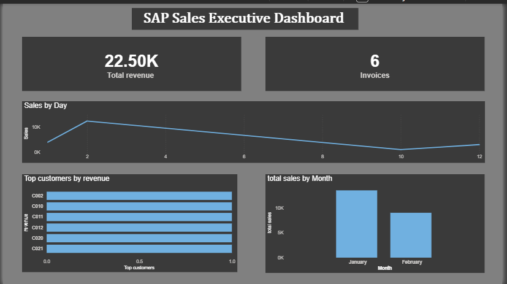

# 🏭 SAP to Power BI Data Pipeline

An end-to-end data engineering project that simulates a real-world **SAP Business One → PostgreSQL → Power BI** analytics pipeline using Python and SQL.

This project demonstrates how enterprise data flows from ERP systems into modern analytics dashboards with automated ETL and warehouse modeling.

---

## 📌 Project Overview

This pipeline simulates extracting structured business data from SAP and transforming it into actionable insights using a layered data architecture.

It showcases:

* SAP-style data ingestion
* Incremental ETL pipelines
* PostgreSQL data warehouse design
* SQL-based analytics modeling
* Power BI dashboarding

---

## 🧱 Architecture

```id="saparch"
Simulated SAP Data → Python ETL → PostgreSQL Warehouse → Power BI Dashboard
```

This mirrors real-world ERP analytics stacks used in enterprises.

---

## ⚙️ Tech Stack

| Layer             | Tools                  |
| ----------------- | ---------------------- |
| Source Simulation | CSV (SAP-style tables) |
| ETL               | Python, Pandas         |
| Database          | PostgreSQL             |
| Connectivity      | psycopg2, dotenv       |
| Analytics Layer   | SQL Views              |
| Visualization     | Power BI               |
| Version Control   | Git                    |

---

## 📂 Project Structure

```id="sapstruct"
sap-hana-to-powerbi-pipeline/
│
├── etl/                  # ETL scripts (incremental loaders)
├── sql/                  # Table & view definitions
├── data/                 # Simulated SAP datasets
├── logs/                 # ETL logs
├── powerbi/              # Dashboard (.pbix)
├── config/               # Environment variables
└── README.md
```

---

## 🔄 ETL Workflow

### 1️⃣ SAP Data Simulation

Simulates SAP tables such as:

* Invoices (OINV-like structure)
* Timestamped updates

Designed to mimic ERP extraction patterns.

---

### 2️⃣ Incremental Loading Logic

Implements watermark-based ingestion:

* Tracks last loaded timestamp
* Loads only new/updated records
* Prevents duplicates
* Enables rerunnable pipelines

This mirrors production ETL behavior.

---

### 3️⃣ Data Loading

* Inserts data into PostgreSQL staging tables
* Uses upsert-safe logic
* Logs execution results

---

## 🗄️ Data Warehouse Design

### Staging Layer

**stg_invoices**

Stores raw transactional data extracted from simulated SAP.

Key columns:

* doc_entry (primary identifier)
* card_code (customer)
* doc_total (invoice value)
* doc_date
* update_date (incremental watermark)

---

## 📊 Analytics Layer (SQL Views)

Business-ready reporting views built on top of staging data.

| View                 | Description             |
| -------------------- | ----------------------- |
| vw_sales_daily       | Daily revenue trends    |
| vw_sales_monthly     | Monthly growth analysis |
| vw_sales_by_customer | Customer-level revenue  |
| vw_sales_summary     | Aggregated KPIs         |

This layered approach follows modern warehouse best practices.

---

## 📈 Power BI Dashboard

Interactive dashboard built using reporting views.

### Key Features:

* Revenue KPIs
* Sales trends
* Customer insights
* Time-based analysis

Designed with:

* Executive layout
* Clean KPI cards
* Business-focused visuals

---

## 🚀 Automation

The project supports production-style automation:

* Daily ETL scheduling (Task Scheduler / Cron)
* Incremental refresh logic
* Logging for monitoring

This demonstrates real-world pipeline operability.

---

## 🚀 How to Run Locally

### 1️⃣ Clone Repository

```bash id="sapclone"
git clone <https://github.com/Jai-rokkala/sap-hana-to-powerbi-pipeline >
cd sap-hana-to-powerbi-pipeline
```

---

### 2️⃣ Create Virtual Environment

```bash id="sapvenv"
python -m venv venv
venv\Scripts\activate  # Windows
```

---

### 3️⃣ Install Dependencies

```bash id="sapdeps"
pip install -r requirements.txt
```

---

### 4️⃣ Configure Environment Variables

Create:

```id="sapenvpath"
config/.env
```

Example:

```id="sapenv"
PG_HOST=localhost
PG_PORT=5432
PG_USER=postgres
PG_PASSWORD=your_password
PG_DB=sap_pipeline
```

---

### 5️⃣ Create Tables

Run SQL from:

```id="sapsql"
sql/create_tables.sql
```

---

### 6️⃣ Run ETL

```bash id="saprun"
python etl/load_from_sap_simulated.py
```

Re-running the script demonstrates incremental loading.

---

## 📊 Dashboard Preview





---

## 💡 Key Learnings

This project demonstrates:

* Designing incremental ETL pipelines
* Simulating enterprise ERP ingestion
* Building layered warehouse models
* Implementing watermark-based loading
* Creating BI-ready data marts

---

## 📌 Future Improvements

Potential enhancements:

* Real SAP HANA connector
* Airflow orchestration
* Docker deployment
* REST API layer (FastAPI)
* Cloud warehouse migration

---

## 👤 Author

**Your Name**
Jai Rokkala | Python Developer

Focused on building real-world data pipelines and analytics systems.

---

## ⭐ If You Like This Project

Consider giving it a ⭐.